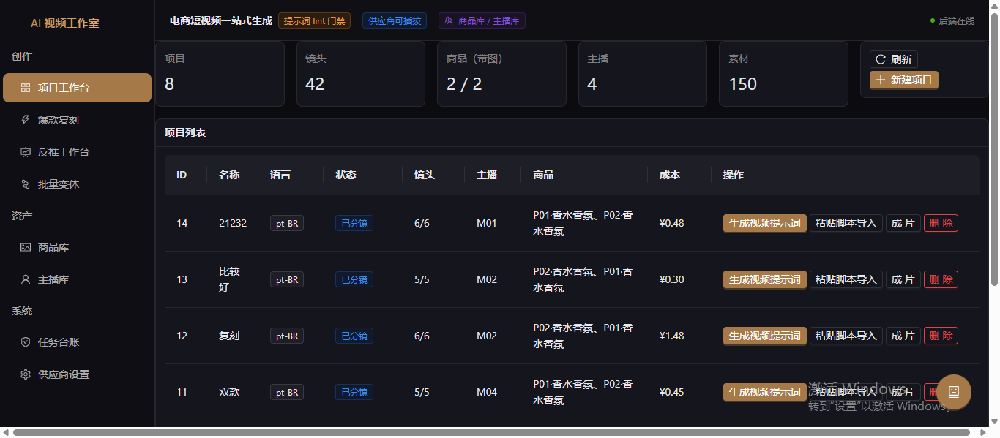

<div align="center">

# ai-video-studio

**AI 香水带货短视频生成工作台**

从商品图 + 主播形象出发，一键产出「分镜脚本 → 分镜提示词 → 分镜画面 → 图生视频 → 念白配音 → 成片」的完整带货短视频流水线。

FastAPI · SQLAlchemy · SQLite · React 18 · TypeScript · Ant Design · Vite



</div>

---

## 功能总览

| 模块 | 能力 |
|---|---|
| **项目管理** | 商品、参考图（商品图/主播图分角色管理）、主播库（录入 → LLM 扩写 → 文生图三段递增） |
| **生文引擎** | 双链路：并发分镜生成（默认）与 Trae Agent 单会话模式；五段式念白、叙事弧结构、逐镜 i2v 提示词 |
| **爆款复刻** | 上传参考片 → 视觉反推（网格图定时间轴 + 逐镜高清复核）→ **画面级复刻**（只换模特与产品，场景/构图/运镜/光影逐条沿用）→ 剪辑点硬约束 |
| **出片流水线** | 文生图 → 图生视频（AutoDL ComfyUI 云平台 / 私有 ComfyUI）→ ffmpeg 装配、混音、字幕；复用判据避免重复计费 |
| **合规审查** | 中国《广告法》/ 巴西 CONAR / 拉美消费者保护三套独立词表；自定义规则热加载 |
| **预算闸门** | 单次 / 单项目 / 全局三层花费上限，先落台账再发请求，"提交即计费"操作统一拦截 |
| **防穿帮闸门** | 喷雾落点、人物着装合规（正向+负向）、镜头运动冲突等八道自动化闸门，生成前自动修补提示词 |
| **MCP Server** | stdio MCP 服务器，可在任意 MCP 客户端中驱动本项目能力 |
| **便携打包** | PyInstaller onedir 一键打成免安装 zip（内置 ffmpeg，解压即用） |

## 架构

```
frontend/  React 18 + TS + Vite + AntD（构建产物由后端单端口托管）
backend/
  app/
    api/        REST 接口（projects / produce / reverse / render / providers ...）
    services/   业务核心（scriptgen 生文引擎 / produce 出片流水线 / reverse 视觉反推 ...）
    providers/  供应商适配层（LLM / 文生图 / 图生视频，全部 YAML 可配、代码零改动接入新渠道）
    pipeline/   合规词表等流水线组件
    security/   keyring 凭据库（密钥不落盘、不进日志）
    mcp/        MCP server 实现
    db/         SQLAlchemy 模型 + Alembic 迁移
  kb/           提示词知识库（铁律 / 模板 / 评分卡 / 文案规范）
  migrations/   Alembic 迁移脚本
  scripts/      工具脚本（遮罩生成、复刻验收线等）
  data/         运行时数据（不入库 git）
docs/           Trae Agent 模式文档
build/          便携版打包脚本（PyInstaller）
```

## 快速开始

### 环境要求

- Python ≥ 3.12、Node.js ≥ 18
- **ffmpeg / ffprobe** 在 PATH 中（抽帧、装配、混音依赖）

### 1. 后端

```bash
cd backend
pip install -r requirements.txt
cp providers.example.yaml providers.yaml   # 按注释填你的供应商

# 配置密钥（二选一）：
#   a. 环境变量，如 OPENAI_API_KEY / AUTODL_TOKEN
#   b. 启动后在网页「设置」页写入凭据库（推荐，不落盘）

python start_backend.py                    # 守护式启动，http://127.0.0.1:8000
```

### 2. 前端

```bash
cd frontend
npm install
npm run build                              # 产物 dist/ 由后端托管
# 开发模式（可选）：npm run dev，走 Vite 热更新
```

重新打开 `http://127.0.0.1:8000` 即可使用。

### 3. 视频生成通道

默认适配 **AutoDL ComfyUI 云平台**（`AUTODL_TOKEN`）与 **本地 ComfyUI**（免费）。
任意 OpenAI 兼容中转站（LLM / 文生图 / 图生视频）只需改 `providers.yaml` 的
`base_url`，路径与字段全部可配，代码零改动。详见 `backend/providers.example.yaml` 注释。

### 4. （可选）便携版打包

```bash
python build/make_portable.py              # 产出免安装 zip，见 build/PORTABLE_BUILD.md
```

## 密钥安全

- 密钥只存两处：环境变量，或系统凭据库（Windows Credential Manager / keyring）
- `providers.yaml` 只写**变量名**（`api_key_env` / `token_env`），永不写密钥本身
- 仓库内不包含任何真实密钥；提交前请确认 `providers.yaml` 已被 `.gitignore` 排除

## 花费提醒

出片是"提交即计费"的非幂等操作。建议在「设置 → 花费上限」配置预算闸门：
单次提交上限（`per_task_cap_cny`）是最直接的手滑保护；台账（`render_task` 表）
会记录每一笔计费请求，包括结果未知的在途任务。

## MCP 接入

```json
{
  "mcpServers": {
    "ai-video-studio": {
      "command": "python",
      "args": ["/path/to/backend/mcp_server.py"]
    }
  }
}
```

详见 `backend/app/mcp/README.md`。

## 路线图

- [ ] 遮挡重绘（masked V2V）画面级复刻：原片遮罩外逐像素保留（POC 进行中）
- [ ] 成片 vs 原片自动比对校验器
- [ ] 更多视频平台适配（可参考 `openai_video` 适配器的四点可配设计）
- [ ] 多语言界面

## 贡献

欢迎 Issue 与 PR，见 [CONTRIBUTING.md](CONTRIBUTING.md)。

## 免责声明

本项目仅提供内容生成工具链。使用本项目生成的内容请遵守当地法律法规与广告规范；
合规词表（`backend/app/pipeline/compliance.py`、`compliance.yaml`）是辅助手段，
不能替代人工审核。生成视频所调用的云平台按其自身计费规则收费，请自行配置预算上限。

## License

[MIT](LICENSE)
